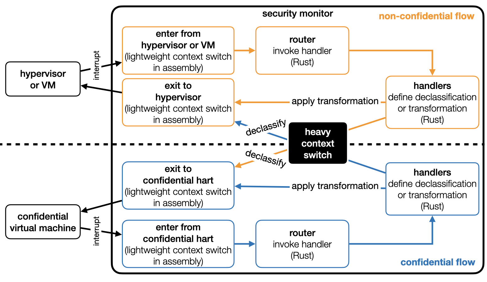

# Security monitor
Our formal proof efforts focus on the security monitor implementation. The security monitor is implemented in Rust. There are minor parts that require assembly, e.g., context switches. Read more about our approach in the [paper](https://arxiv.org/abs/2308.10249).

## Implementation
 

Above Figure presents the finite state machine (FSM) implemented by the security monitor. [Non-confidential Flow](src/non_confidential_flow) implements the non-confidential part of the FSM (orange) and [Confidential Flow](src/confidential_flow) implements the confidential part of the FSM (blue). Heavy context switch occures during ["stealing"](https://github.com/IBM/ACE-RISCV/blob/bfd1e84d44075c45b7bd094f9750b3fdecbad4a5/security-monitor/src/core/control_data/confidential_vm.rs#L64) and ["returning"](https://github.com/IBM/ACE-RISCV/blob/bfd1e84d44075c45b7bd094f9750b3fdecbad4a5/security-monitor/src/core/control_data/confidential_vm.rs#L96) a confidential hart from/to a confidential VM.

## Dependencies
To speed up the implementation, we used OpenSBI as firmware. OpenSBI runs together with the security monitor in the M-mode. The ultimate goal is to deprivilege it or re-implement it in Rust and then formally verify. Our principle is to rely on as minimal Rust dependencies as possible.

## Proofs
We will interatively add our proofs to the repository. Check the [verification](../verification/) folder to learn more.

# Citation
**This is an active research project, without warranties of any kind.**

```
@inproceedings{ozga2023riscvtee,
    title={Towards a Formally Verified Security Monitor for VM-based Confidential Computing},
    author={Ozga, Wojciech and Hunt, Guerney D. H. and Le, Michael V. and Palmer, Elaine R. and Shinnar, Avraham},
    booktitle = {Proceedings of the 12th International Workshop on Hardware and Architectural Support for Security and Privacy},
    series = {HASP2023},
    year={2023}
}
```
